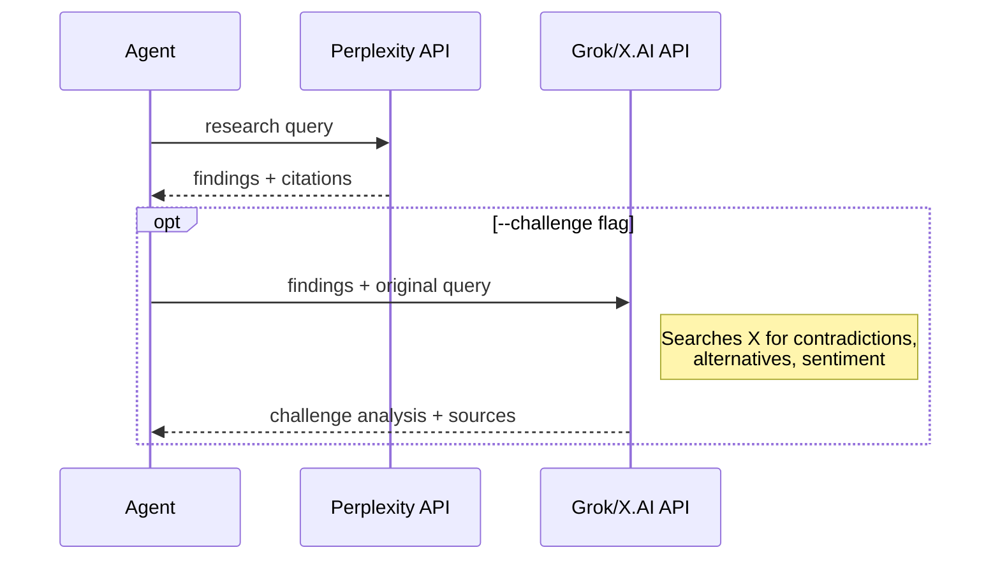

## Intent

Agents need to retrieve knowledge from two distinct sources: **local project knowledge** (solutions + memories) and **external web knowledge** (documentation, research). The search commands provide a unified CLI surface for both, with consistent JSON output that agents can parse. The local search commands use weighted keyword scoring against structured frontmatter rather than full-text search, trading recall for precision and avoiding embedding infrastructure. Solutions search includes AI aggregation that synthesizes matched solutions with memory context from `docs/memories.md`.

## Local Knowledge Search

### Solutions Search

[ref:.allhands/harness/src/commands/solutions.ts:searchSolutions:19e47dd] searches documented solutions in `docs/solutions/`. Solutions are markdown files with YAML frontmatter containing structured fields (title, tags, component, symptoms, root_cause, severity).

Scoring weights determine field importance:

| Field | Weight | Rationale |
|-------|--------|-----------|
| title | 3 | Strongest signal -- direct topic match |
| tags | 3 | Curated identifiers, high precision |
| component | 2 | Narrows to subsystem |
| symptoms | 2 | Matches problem description |
| problem_type | 1 | Broad categorization |
| root_cause | 1 | Technical detail |

[ref:.allhands/harness/src/commands/solutions.ts:scoreSolution:19e47dd] computes a cumulative score per keyword across all fields. [ref:.allhands/harness/src/commands/solutions.ts:extractKeywords:19e47dd] handles quoted phrases and whitespace splitting, allowing queries like `"tmux session" timeout`.

### Memory Integration

Solutions search automatically loads all memory entries from `docs/memories.md` and includes them in the AI aggregation context. This means a single `ah solutions search` call returns synthesized guidance from both solution files and memory entries, with `memory_insights` in the output identifying relevant memories. Use `--no-aggregate` to get raw keyword matches without memory context.

### Search Design

Solutions search has these characteristics:
- Keyword extraction with quoted phrase support ([ref:.allhands/harness/src/commands/solutions.ts:extractKeywords:19e47dd])
- Cumulative scoring across multiple fields
- Results sorted by score descending, truncated to `--limit`
- AI aggregation via solutions-aggregator agent (with graceful degradation to raw matches on failure)
- JSON output with synthesized `guidance`, `relevant_solutions`, `memory_insights`, and `design_notes`
- `--no-aggregate` flag for raw keyword matches with `matchedFields` array

## External Web Research

### Perplexity

[ref:.allhands/harness/src/commands/perplexity.ts:callPerplexityApi:e041bed] sends queries to Perplexity's `sonar-pro` model, which returns AI-synthesized answers with citation URLs. The distinctive feature is the `--challenge` flag, which sends Perplexity's findings to [ref:.allhands/harness/src/commands/perplexity.ts:callGrokChallengeApi:e041bed] (Grok/X.AI) for adversarial validation. The Grok challenger prompt specifically targets contradicting opinions, newer alternatives, and developer sentiment from X/Twitter posts.

### Tavily

[ref:.allhands/harness/src/commands/tavily.ts:callTavilyApi:3ab56fe] provides two capabilities:

- **Search** (`ah tavily search`): Web search with optional LLM-generated answer, configurable max results (capped at 20)
- **Extract** (`ah tavily extract`): Full content extraction from up to 20 URLs, returned as markdown

### Context7

Context7 bridges from library names to documentation context in a two-step flow:

1. `ah context7 search <library>` -- Finds libraries by name, returns IDs with trust scores and snippet counts
2. `ah context7 context <libraryId> <query>` -- Retrieves documentation context for a known library, supporting both JSON (structured docs) and `--text` (plain text for direct LLM consumption) output modes

## API Key Requirements

| Command | Environment Variable | Required |
|---------|---------------------|----------|
| `ah perplexity research` | `PERPLEXITY_API_KEY` | Yes |
| `ah perplexity research --challenge` | `X_AI_API_KEY` | Additionally required |
| `ah tavily search` / `extract` | `TAVILY_API_KEY` | Yes |
| `ah context7 search` / `context` | `CONTEXT7_API_KEY` | Yes |

All external commands use abort controllers with configurable timeouts (default 60s for Perplexity, 120s for Grok/Tavily/Context7) and surface errors as structured JSON when `--json` is passed.
